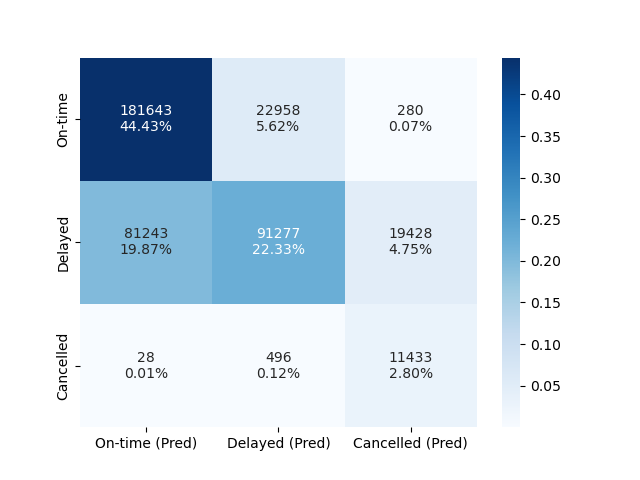
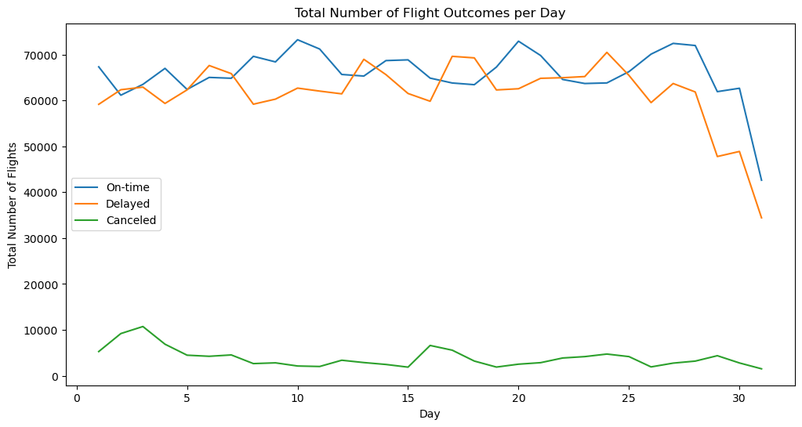
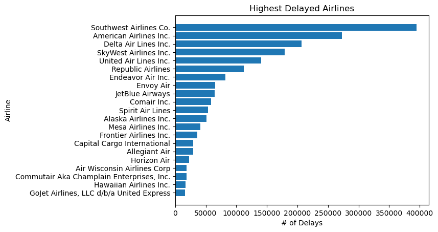
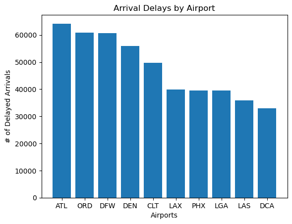

## Overview/Purpose

It is crucial for airline companies to ensure that air travel is safe, efficient, and reliable. 
Flight delays can have a significant economic and social impact on both individuals and organizations. We have identified trends to pinpoint the causes of delays to help develop strategies to mitigate their effects. 
Using Machine learning we can help passengers have informed expectations about their travel plans, such as choosing the best time to fly or selecting a carrier with a good on-time performance record.

As you can see in the data set link below, we used numerous columns and rows to help us analyze the data to the best of our ability. 

### [Link to our Data Set](https://www.kaggle.com/datasets/robikscube/flight-delay-dataset-20182022)
* We used the flights_2022 1-7 CSV files as well as Airlines.csv

## Questions to answer:
* **Main Question: what are the main causes for flight delays and cancellations?**
* % of flights delayed
* Top 10 airlines with the most delays/cancellations
* Top 10 delayed/cancelled flights by origin
* Top 10 delayed/cancelled flights by destination
* Highest % cause of delays/cancellations
  * Carrier
  * Weather
  * NAS Delay
  * Security
  * Late Aircraft
* What time of day is more common to have flight cancellations?

## Summary

### Methods
To determine an answer to the primary question that encapsulates all features of the data and how they may interact to lead to a flight being delayed or cancelled we used a classification model to predict outcomes into 3 target classes. Since the focus is understanding what are the main causes that determine flight outcomes a model that is hierarchical in its a structure was desired, and due to the number of features being used ultimately a random forest classifier was chosen. Exploratory data analysis found that while the on-time and delayed classes were similar in sample size, cancellations accounted for a small proportion of the data, so to counteract this we chose Imblearn's Balanced Random Forest Classifier that randomly under-samples the data to form decision trees.

The features that our model used for prediction are:
* Operating Airline
* Origin Airport
* Destination Airport
* Hour of the Scheduled Arrival Time
* Hour of the Scheduled Departure Time
* Month
* Day
* Carrier Issue
* Bad Weather
* National Aviation System (includes things such as airport operation, traffic volume)

Once the model was fitted and scoring features determined, the feature importances were ranked to determine areas of interest to visualize.

### Results

|  |
| :---: |
| Confusion Matrix for Balanced Random Forest Model |

* Model Accuracy: 77.4%
* Percision Values:
    * On-time: 69%
    * Delayed: 80%
    * Cancelled: 37%
* Recall Values:
    * On-time: 89%
    * Delayed: 47%
    * Cancelled: 95%

The model's performance is not ideal but is still at an acceptable level to have confidence in how it ranks the features. Notably the model performs badly in decisions between cancellations and delays, with it misclassifying many delays as cancellations when making predictions, leading to a low precision score for cancellations and a low recall for delays. Ultimately this analysis aims to examine causes in a broad lens and is more interested in the feature importances as long as the model has sufficient evidence that those features are leading to mostly accurate predictions, which the current accuracy of 77.4% achieves.

The top 5 features from the feature importances are as follows:
1. Bad Weather
2. Day
3. Carrier Issue
4. Destination Airport
5. Origin Airport

The biggest surprise the model gave is the Day of the month (irrespective of which month it is) is the 2nd highest ranked feature. Viewing this as a time series there does seem to be something to the flucations in flight outcomes when the days are aggregated for the entire period under examination, however with the data currently available to us and the scope of this analysis the causes for those fluctuations are indeterminable.

|  |
| :---: |
| Time Series of Total Number of Flights per each Flight Outcome |

Otherwise weather as the top factor the model used for branching out decision trees is unsurprising. Airlines in general being the 3rd most important reported as carrier issues is also expected, leading to the desire to see which airlines are performing the worse for both the delays and cancellations:

|  |
| :---: |
| Top Delayed Airlines |

|  |
| :---: |
| Top Cancelled Airlines |

Based on the results many more questions arise that are worth exploring. With weather being the top factor, what weather patterns lead to delays or cancellations? This factor is likely closely linked with the 4th and 5th features the model deemed important, the destination and origin airports. Why is day such a huge factor? We envision another important feature not avaiable in this data set, the number of seats sold per flight, being a large factor both overall and one that might relate to this. For the time being, consumers can make reasonable assumptions on which airlines they risk a delay or cancellation riding with, and which airports they may be delayed flying out of:

|  |
| :---: |
| Top Delayed Airlines |

|  |
| :---: |
| Top Cancelled Airlines |
